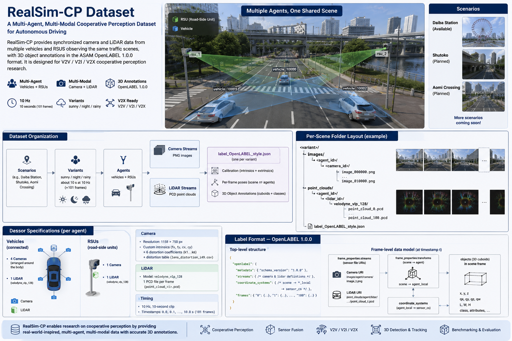

<div align="center">

# RealSim-CP

**A High-Fidelity Multimodal Cooperative Perception Dataset for Japanese Traffic**

Synchronized **camera + LiDAR** data from multiple connected **vehicles and roadside units (RSUs)**, with 3D annotations in **ASAM OpenLABEL** — generated with the physics-based **DIVP** simulator.

[📖 Documentation](https://tlab-wide.github.io/realsim-cp/) ·
[⬇️ Download dataset](https://drive.google.com/drive/folders/12aOsca1vCpP0ncBdA1NF39xsphXoEV-Z) ·
[🚀 Quickstart](https://tlab-wide.github.io/realsim-cp/getting-started/quickstart/) ·
[📊 Benchmark](https://tlab-wide.github.io/realsim-cp/benchmark/)

[](https://tlab-wide.github.io/realsim-cp/)
[](DATA_LICENSE.md)
[](LICENSE)
[](#citation)



</div>

## Overview

RealSim-CP is a cooperative-perception dataset for **V2V / V2I / V2X** research:
several connected agents observe the same traffic scene from different
viewpoints and share sensor data to perceive the environment better than any
single agent could. It targets **Japanese urban traffic** — left-hand driving,
distinctive vehicle types, and region-specific infrastructure — and is generated
with **DIVP**, a physics-based simulator (ray tracing + electromagnetic-wave
modeling), so the data stays close to real sensor physics at a fraction of the
cost of real-world collection.

| | |
|---|---|
| **Modalities** | RGB camera images + LiDAR point clouds (`.pcd`) |
| **Agents** | Connected vehicles (4 cameras + 1 LiDAR) + RSUs (camera ± LiDAR) |
| **Region** | Tokyo: Aomi, Odaiba/Daiba, Shutoko Expressway |
| **Conditions** | Clear day · rainy day · clear night |
| **Annotations** | 3D cuboids, 12 classes, ASAM OpenLABEL 1.0.0 |
| **Scale** | ~140k images · ~30k point clouds · ~1,800 frames · 728 cameras · 172 LiDARs |
| **Rate** | 10 Hz synchronized |

<div align="center">

| Clear day | Clear night | Rainy day |
|:--:|:--:|:--:|
|  |  |  |

</div>

## Download

The dataset is hosted on Google Drive:

> **➡️ https://drive.google.com/drive/folders/12aOsca1vCpP0ncBdA1NF39xsphXoEV-Z**

Variants are independent, so you can start with a single scene (a few GB). A good
first download is **`daiba_station_scenario/night_1`** (full camera + LiDAR
coverage). See the [Download guide](https://tlab-wide.github.io/realsim-cp/dataset/download/).

## Documentation

Full documentation is published at
**[tlab-wide.github.io/realsim-cp](https://tlab-wide.github.io/realsim-cp/)**:

- [Overview](https://tlab-wide.github.io/realsim-cp/overview/) — motivation, methodology, contributions
- [Dataset structure](https://tlab-wide.github.io/realsim-cp/dataset/structure/) · [Sensors](https://tlab-wide.github.io/realsim-cp/dataset/sensors/) · [Label format](https://tlab-wide.github.io/realsim-cp/dataset/label-format/) · [Scenarios & maps](https://tlab-wide.github.io/realsim-cp/dataset/scenarios/)
- [Quickstart](https://tlab-wide.github.io/realsim-cp/getting-started/quickstart/) · [Loading the data](https://tlab-wide.github.io/realsim-cp/getting-started/loading-data/)
- [Tools](https://tlab-wide.github.io/realsim-cp/tools/) · [Simulator (DIVP)](https://tlab-wide.github.io/realsim-cp/simulator/divp/) · [Benchmark](https://tlab-wide.github.io/realsim-cp/benchmark/)

## Quickstart

```bash
# 1. Download daiba_station_scenario/night_1 from the Drive link above.

# 2. Install the visualizer (needs Python 3.12 + Open3D)
cd tools/realsim-cp-visualizer
py -3.12 -m venv .venv         # Windows; use python3.12 on macOS/Linux
.\.venv\Scripts\activate
python -m pip install -e .

# 3. Run it on the downloaded scene
python -m realsim_viz "C:\data\RealSim-CP\daiba_station_scenario\night_1"
```

See the [Quickstart guide](https://tlab-wide.github.io/realsim-cp/getting-started/quickstart/)
for details and controls.

## Repository layout

```
realsim-cp/
├── docs/                       # documentation site (MkDocs Material)
├── tools/
│   ├── realsim-cp-visualizer/  # Open3D 3D + dashboard viewer
│   ├── divp-automation-tool/   # OpenLABEL label generation (DIVP/MATLAB)
│   └── trajectory-visualizer/  # Matplotlib trajectory plotter
├── mkdocs.yml
├── LICENSE                     # MIT (code)
├── DATA_LICENSE.md             # CC BY 4.0 (dataset)
└── CITATION.cff
```

The traffic simulator that produces scenario trajectories lives in a separate
repo: [tlab-wide/osmx-trafficsim](https://github.com/tlab-wide/osmx-trafficsim).

## Tools

| Tool | Purpose |
|---|---|
| [Visualizer](tools/realsim-cp-visualizer/) | 3D scene + per-agent camera/LiDAR dashboard for the dataset |
| [Automation tool](tools/divp-automation-tool/) | Generates OpenLABEL labels from DIVP simulation runs |
| [Trajectory visualizer](tools/trajectory-visualizer/) | Plots agent trajectories from CSVs |
| [osmx-trafficsim](https://github.com/tlab-wide/osmx-trafficsim) | Naturalistic traffic generation (separate repo) |

## License

- **Dataset:** [Creative Commons Attribution 4.0 (CC BY 4.0)](DATA_LICENSE.md) —
  free to use, including commercially, with attribution.
- **Code & tools:** [MIT](LICENSE).

## Citation

If you use RealSim-CP, please cite:

```bibtex
@inproceedings{aizono2026realsimcp,
  title     = {RealSim-CP: A High-Fidelity Multimodal Cooperative Perception
               Dataset Bridging the Simulator--Real World Gap},
  author    = {Aizono, Yuji and Javanmardi, Ehsan and Ayar, Fardin and
               Javanmardi, Mahdi and Tsukada, Manabu and Esaki, Hiroshi},
  booktitle = {IEEE Vehicular Technology Conference (VTC2026-Fall)},
  year      = {2026},
}
```

## Acknowledgement

The dataset was generated with the **DIVP®** simulator (<https://divp.net/>); we
thank the DIVP consortium for access. This work was supported by **JST CRONOS,
Japan** (Grant Number **JPMJCS24K8**).

## Contact

Questions or issues? Open an issue on
[GitHub](https://github.com/tlab-wide/realsim-cp/issues), or contact
Ehsan Javanmardi (`ejavanmardi@g.ecc.u-tokyo.ac.jp`), The University of Tokyo.
