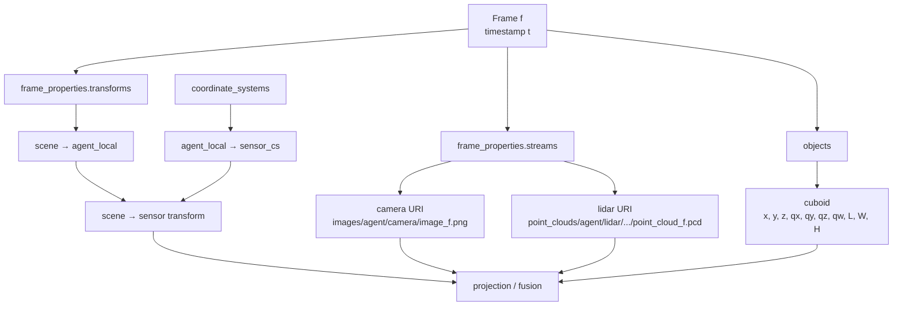
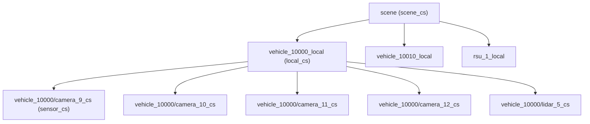
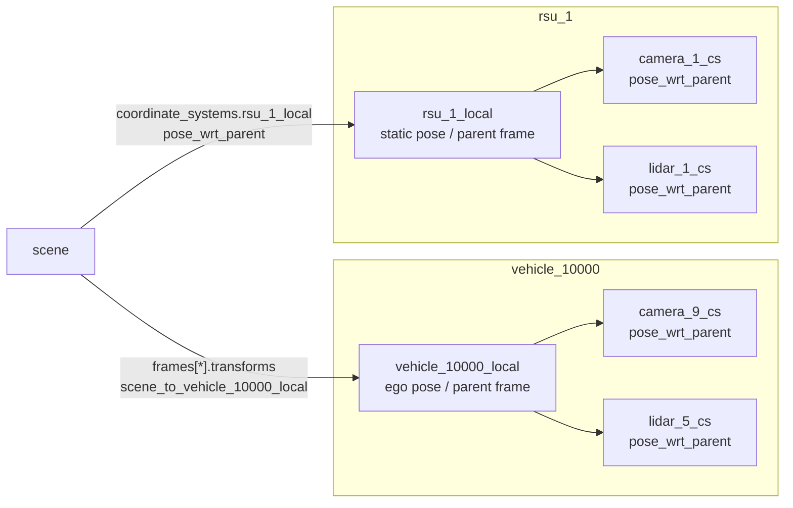
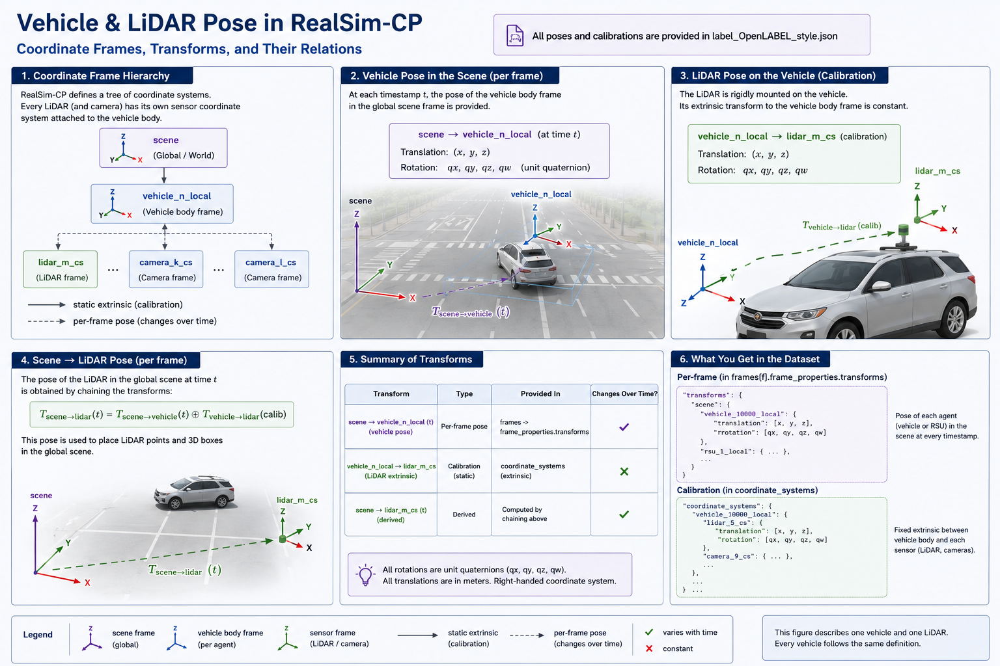
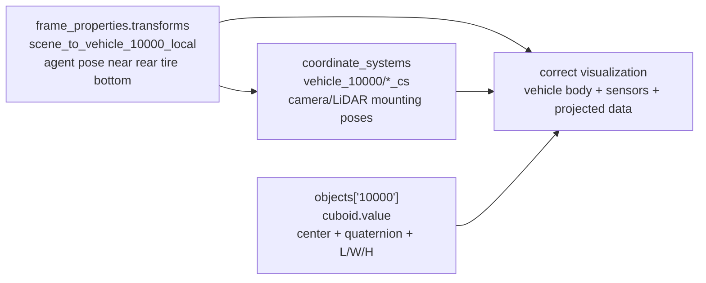

# Label Format — OpenLABEL 1.0.0

Each scene variant ships a single `label_OpenLABEL_style.json` following the
**ASAM OpenLABEL 1.0.0** schema. It contains everything needed for cooperative
perception: sensor declarations, the coordinate-system tree, per-frame agent
poses, the raw sensor file URIs, and the 3D object annotations.

## Top-level shape

```jsonc
{
  "openlabel": {
    "metadata":           { "schema_version": "1.0.0" },
    "streams":            { /* one entry per sensor — camera or lidar */ },
    "coordinate_systems": { /* scene → *_local → sensor_cs tree */ },
    "frames":             { "0": {...}, "1": {...}, ..., "100": {...} }
  }
}
```



## Streams

Each `streams[<agent>/<sensor>]` declares the sensor type and its intrinsics /
resolution. See [Sensors](sensors.md) for a worked camera example.

## Coordinate systems

A three-level tree links the scene frame to every sensor:



- **`pose_wrt_parent`** on each `sensor_cs` is the sensor's extrinsic relative to
  its agent — constant over time (a calibration).
- **Per-frame agent poses** live under `frames[<id>].frame_properties.transforms`
  as e.g. `scene_to_vehicle_10000_local`, each with `{ quaternion, translation }`.
- Vehicle-local and RSU-local frames are the parent frames for the sensors
  mounted on them.



Example sensor extrinsics:

```jsonc
"vehicle_10000/camera_9_cs": {
  "type": "sensor_cs",
  "parent": "vehicle_10000_local",
  "pose_wrt_parent": {
    "quaternion": [0.0, -0.0026, 0.0, 1.0],
    "translation": [-3.4916, 0.0, -1.6143]
  }
},
"vehicle_10000/lidar_5_cs": {
  "type": "sensor_cs",
  "parent": "vehicle_10000_local",
  "pose_wrt_parent": {
    "quaternion": [0.0, -0.0262, 0.0, 0.9997],
    "translation": [-1.0255, 0.0, -2.5021]
  }
}
```

### The transform chain

To place a sensor (or its data) in the scene, compose the agent pose with the
sensor's mounting extrinsic:

```text
sensor_to_scene = local_to_scene(agent_local) ∘ sensor_to_local(sensor_cs)
scene_to_sensor = inverse(sensor_to_scene)
```

- For **vehicles**, `local_to_scene` comes from the per-frame
  `scene_to_vehicle_*_local` transform (inverted).
- For **static RSUs**, it usually comes from
  `coordinate_systems[rsu_*_local].pose_wrt_parent`.

The same chain applies to LiDAR: place the agent-local frame in the scene, then
apply the LiDAR `pose_wrt_parent`.



/// caption
Expanded transform chain for one vehicle and one LiDAR. The vehicle pose changes
per frame; the LiDAR mounting pose is a static calibration. Chaining both gives
the LiDAR pose in the scene at that timestamp.
///

## Frames

```jsonc
"frames": {
  "0": {
    "frame_properties": {
      "timestamp": 0.0,
      "streams":   { "vehicle_10000/camera_9": { "uri": "images/vehicle_10000/camera_9/image_000000.png" }, ... },
      "transforms":{ "scene_to_vehicle_10000_local": { "transform_src_to_dst": { "quaternion": [...], "translation": [...] } }, ... }
    },
    "objects": {
      "10040": {
        "object_data": {
          "type": "TYPE_PEDESTRIAN",
          "name": "TYPE_PEDESTRIAN_10040",
          "cuboid": {
            "name": "shape3D",
            "value": [ x, y, z,  qx, qy, qz, qw,  length, width, height ]
          }
        }
      }
    }
  }
}
```

!!! tip "Cuboid value vector (10 numbers)"
    `[x, y, z, qx, qy, qz, qw, length, width, height]` — position + orientation
    quaternion + extents, expressed in the **scene** frame. Note the **xyzw**
    quaternion order (not wxyz).

## Vehicle pose origin vs. labeled cuboid

A connected vehicle's **agent pose** (`vehicle_*_local`) is the parent frame for
its mounted sensors and sits near the **rear-axle ground point** — *not* the
geometric body center. To draw the visible vehicle body, use its matching
**labeled object cuboid** instead.



For `daiba_station_scenario/night_1`, the `vehicle_10000` cuboid is
`TYPE_MEDIUM_CAR`, ~`4.994 × 1.919 × 1.715` m. Expressed in `vehicle_10000_local`
its center is about `(1.379, 0.000, 0.857)` — the `z` ≈ height/2 while `x` is
well below length/2, confirming the agent pose is not the body center.

## Object classes

The Daiba Station scenario uses: `TYPE_PEDESTRIAN`, `TYPE_SMALL_CAR`,
`TYPE_COMPACT_CAR`, `TYPE_MEDIUM_CAR`, `TYPE_LUXURY_CAR`, `TYPE_BUS`. The full
dataset spans 12 classes; see [Benchmark](../benchmark.md) for the complete list
and the evaluation class mapping.

## See also

- [Loading the data](../getting-started/loading-data.md) — Python code to walk a
  variant, compose transforms, and project cuboids.
- [Known issues](known-issues.md) — point-cloud gaps and other quirks loaders
  must tolerate.
