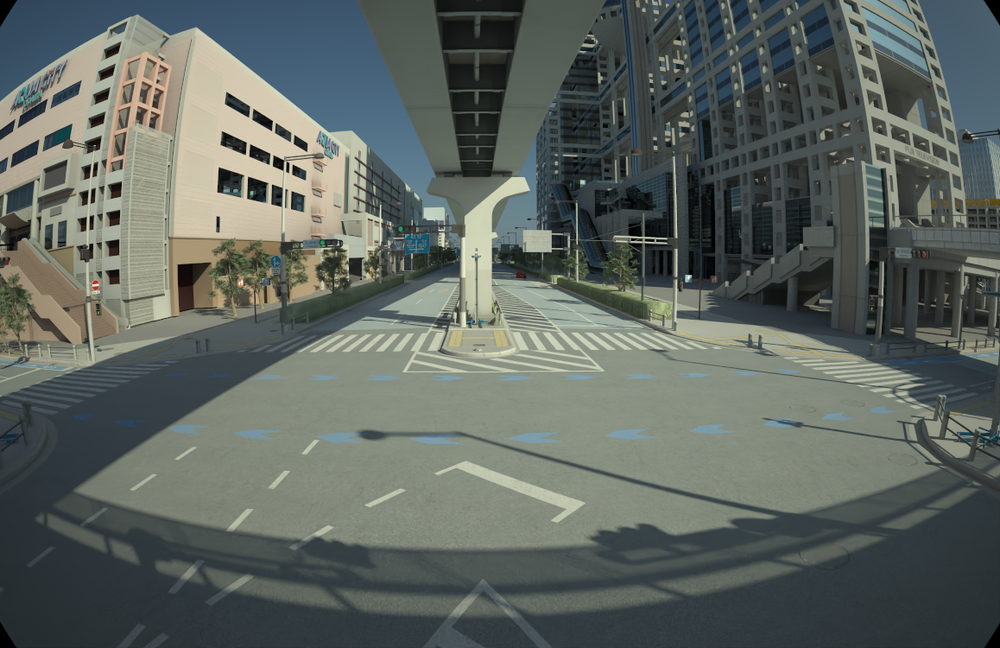
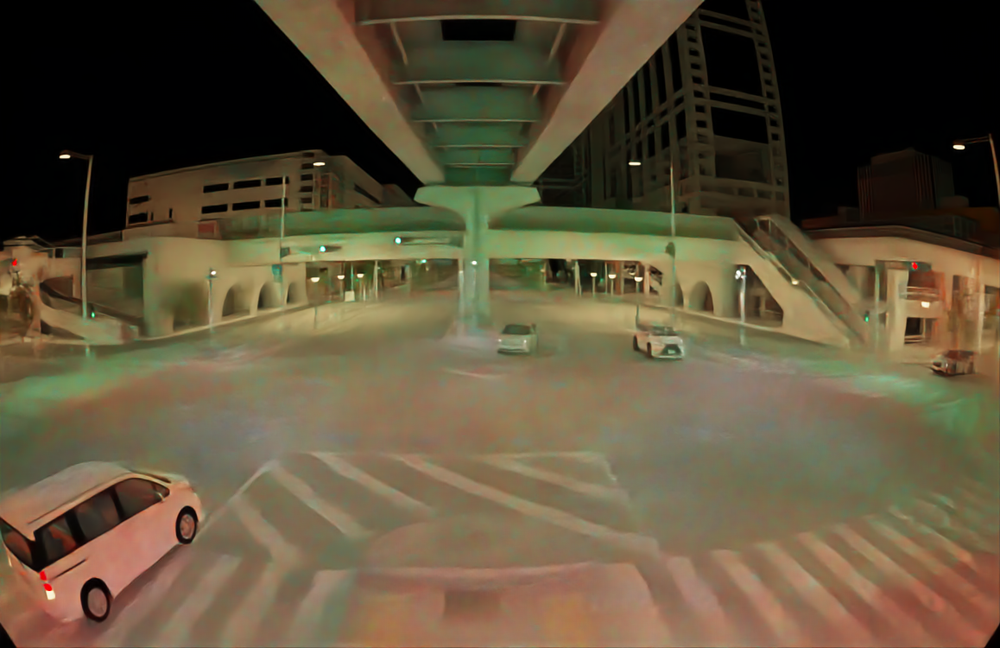
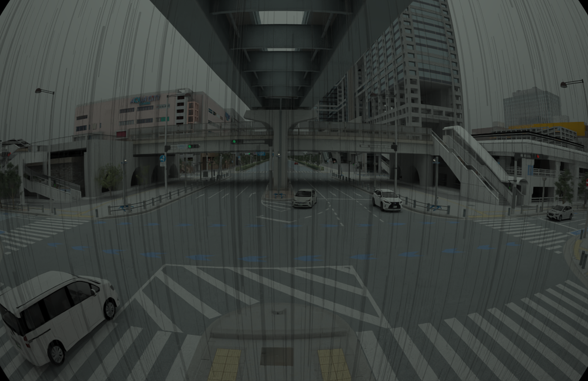

# Scenarios & Maps

RealSim-CP covers three Tokyo environments, each captured under three
weather/time conditions.

## Maps

| Map | Environment | RSUs | Sensor-equipped vehicles |
|---|---|---:|---:|
| **Aomi** | Complex urban intersections | 2–4 | 1–23 |
| **Odaiba / Daiba** | Wide roads, multiple intersections | 4–8 | 1–11 |
| **Shutoko Expressway** | Expressway | 2–6 | 1–47 |

Each map is captured under **clear daytime**, **rainy daytime**, and **clear
nighttime** conditions. The physics-based renderer reproduces the visual
character of each condition — note the wet road reflections and reduced
visibility at night below.

/// caption
Clear daytime (RSU camera)
///

/// caption
Clear nighttime (RSU camera)
///

/// caption
Rainy daytime (RSU camera)
///

## Scenario catalogue

| Scenario | Status | Variants |
|---|---|---|
| Daiba Station | Available (documented below) | sunny ×2, night ×2, rainy ×2 |
| Shutoko | Available | weather/time variants |
| Aomi Crossing | Planned | TBD |

The Daiba Station scenario is the worked example used throughout this
documentation.

---

## Daiba Station scenario

Modeled on the area around **Daiba Station, Tokyo**. Six variants across three
weather/time conditions, each ~10 s at 10 Hz.

### Variant summary

| Variant | Frames | Image agents | LiDAR agents | RSUs | Vehicles | Label size |
|---|---:|---:|---:|---:|---:|---:|
| `sunny_1`  | 101 | 12 |  8 ⚠ | 3 |  9 | 2.71 MB |
| `sunny_2`  | 100 | 12 |  0 ⚠ | 3 |  9 | 2.69 MB |
| `night_1`  | 101 | 15 | 14   | 4 | 11 | 2.71 MB |
| `night_2`  | 100 | 15 | 14   | 4 | 11 | 2.69 MB |
| `rainy_1`  | 101 |  5 |  5   | 4 |  1 | 1.31 MB |
| `rainy_2`  | 100 |  5 |  5   | 4 |  1 | 1.30 MB |

⚠ See [Known issues](known-issues.md) for the `sunny_1` / `sunny_2` point-cloud
gaps.

### Agent roster — `night_1` (most complete variant)

| Agent | Role | Cameras | LiDAR |
|---|---|---|---|
| `rsu_1` … `rsu_4` | Road-side units (static) | one each (`camera_1..4`) | one each (`lidar_1..4`) |
| `vehicle_10000` | Connected vehicle | `camera_9..12` | `lidar_5` |
| `vehicle_10010` | Connected vehicle | `camera_13..16` | `lidar_6` |
| `vehicle_10020` | Connected vehicle | `camera_17..20` | `lidar_7` |
| `vehicle_10030` | Connected vehicle | `camera_21..24` | `lidar_8` |
| `vehicle_10060` | Connected vehicle | `camera_25..28` | `lidar_9` |
| `vehicle_10070` | Connected vehicle | `camera_29..32` | `lidar_10` |
| `vehicle_10080` | Connected vehicle | `camera_33..36` | `lidar_11` |
| `vehicle_10090` | Connected vehicle | `camera_37..40` | `lidar_12` |
| `vehicle_10100` | Connected vehicle | `camera_41..44` | `lidar_13` |
| `vehicle_10190` | Connected vehicle | `camera_45..48` | `lidar_14` |
| `vehicle_10200` | Connected vehicle | `camera_49..52` | `lidar_15` |

Total for `night_1`: **52 camera streams + 14 LiDAR streams = 66 sensor
streams**, organized across **86 coordinate systems** (1 scene + 15 agent-local
+ ~70 sensor frames).

### Annotation statistics — `night_1`

- **101 frames** × **13 tracked objects** per frame = **1,313** object instances.
- 13 unique object IDs persist for the whole clip.

| Class | Instances |
|---|---:|
| `TYPE_MEDIUM_CAR` | 505 |
| `TYPE_COMPACT_CAR` | 303 |
| `TYPE_PEDESTRIAN` | 202 |
| `TYPE_SMALL_CAR` | 101 |
| `TYPE_BUS` | 101 |
| `TYPE_LUXURY_CAR` | 101 |
| **Total** | **1,313** |

### Class imbalance

Across the full dataset, vehicle classes (especially cars) dominate — the
Shutoko Expressway in particular is car-heavy. This imbalance is a known
characteristic that affects rare-class detection; see [Benchmark](../benchmark.md).
