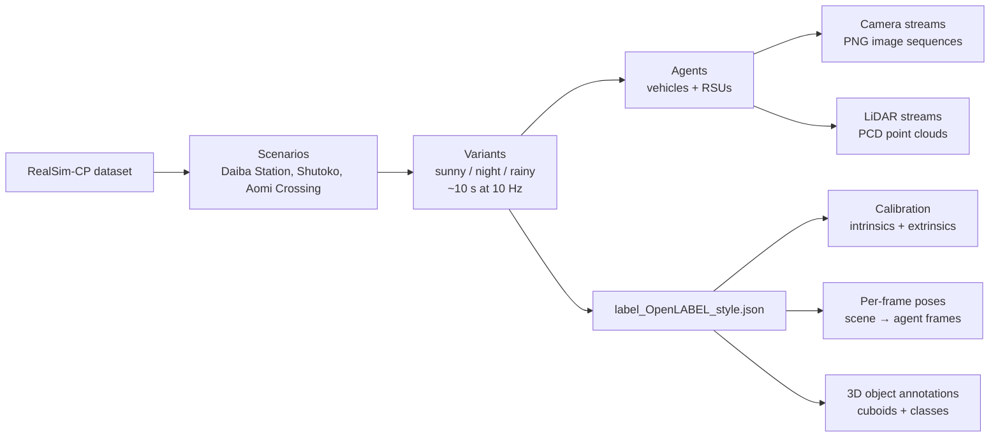
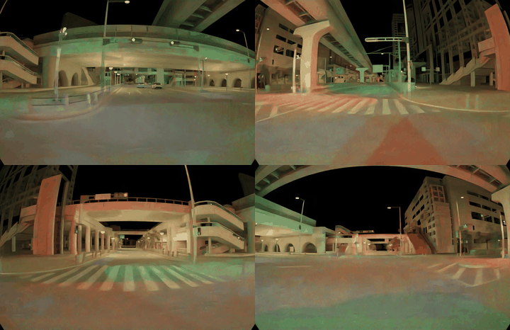

# Dataset Structure

RealSim-CP is organized as a hierarchy: **scenarios → weather/time variants →
agents → sensor streams**, with one OpenLABEL annotation file per variant.



## Per-variant folder layout

Every scene variant has the same on-disk layout:

```
<variant>/
├── images/
│   └── <agent_id>/
│       └── <camera_id>/
│           └── image_000000.png ... image_010000.png
├── point_clouds/
│   └── <agent_id>/
│       └── <lidar_id>/
│           └── velodyne_vlp_128/
│               └── point_cloud_0.pcd ... point_cloud_100.pcd
└── label_OpenLABEL_style.json
```

- **`<agent_id>`** is either `rsu_<n>` (a static road-side unit) or
  `vehicle_<n>` (a moving connected vehicle).
- **`<camera_id>` / `<lidar_id>`** are globally unique sensor IDs. Each agent
  owns a contiguous block of them (e.g. `vehicle_10000` owns `camera_9..12` and
  `lidar_5`).
- **`label_OpenLABEL_style.json`** holds *all* annotations, sensor calibration,
  coordinate frames, and per-frame transforms for the whole variant. See
  [Label format](label-format.md).

## Agents

Two kinds of cooperative agent appear in every scene:

| Agent type | ID pattern | Motion | Typical sensors |
|---|---|---|---|
| Connected vehicle | `vehicle_<n>` | Moves (per-frame pose) | 4 cameras + 1 LiDAR |
| Roadside unit (RSU) | `rsu_<n>` | Static | 1 camera + 1 LiDAR |

Connected vehicles are *also* present as labeled objects: the agent ID suffix
maps to an object ID (e.g. `vehicle_10000` ↔ object `"10000"`), so you can draw
the actual vehicle body from its labeled cuboid. See
[Vehicle pose vs. cuboid](label-format.md#vehicle-pose-origin-vs-labeled-cuboid).

## Sensor streams

Each camera produces a sequence of `image_*.png` files (one per frame), and each
LiDAR produces a sequence of `point_cloud_*.pcd` files. A single variant can
contain dozens of streams — for example, the Daiba `night_1` variant has **52
camera streams + 14 LiDAR streams = 66 sensor streams** across 15 agents.

The example below shows the four cameras of one connected vehicle for the same
frames, side by side:



/// caption
The four cameras of `vehicle_10000` (Daiba `night_1`), played frame-synchronized.
///

## Timing

- **10 Hz**, ~10-second clips → ~101 frames per variant.
- Frame timestamps run `0.0, 0.1, 0.2, …, 10.0` s.
- All sensors of all agents in a variant are time-synchronized.

See [Scenarios & maps](scenarios.md) for the per-scenario catalogue and the
detailed Daiba Station variant tables.
