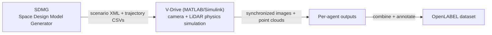

# Overview

RealSim-CP is a **cooperative-perception** dataset: several connected agents —
vehicles and roadside units (RSUs) — observe the same traffic scene from
different viewpoints and share sensor data so the group perceives the
environment better than any single agent could. It targets **V2V / V2I / V2X**
research for autonomous driving in **Japanese** urban environments.

## Motivation

Cooperative perception is essential for moving autonomous driving beyond
single-vehicle limitations such as occlusion and limited field of view. Yet
existing cooperative-perception datasets suffer from two critical limitations:

- **Lack of Japanese traffic representation.** Japan's roads feature left-hand
  traffic, distinctive vehicle types, and region-specific signs and
  infrastructure. Detection models trained on data from one region degrade
  notably when evaluated on another, so region-specific datasets matter.
- **High cost of real-world collection.** Equipping many cooperative agents with
  calibrated sensors and producing accurate multimodal 3D labels at scale is
  expensive and slow, which constrains dataset size and diversity.

RealSim-CP addresses both by generating realistic, perfectly-labeled multimodal
data with a **physics-based simulator** instead of a real sensor fleet.

## How the data is generated

The dataset is produced with **DIVP (Driving Intelligence Validation
Platform)** — a physics-based simulation system that uses **ray tracing** and
**electromagnetic-wave modeling** to render camera and LiDAR data comparable to
real-world quality. Unlike simulators that approximate object shapes to fake
point clouds, DIVP physically simulates sensor operation and is calibrated
against real-world measurements.

A multi-agent (V2X) scene is built by **decomposing** it into several
single-agent simulations — each sensor-equipped agent is simulated
independently, then the outputs are recombined and annotated. A Python
automation layer drives MATLAB to run scenarios at scale. See
**[Simulator (DIVP)](simulator/divp.md)** for the full pipeline.

## What's in the dataset

- **Three Tokyo maps:** Aomi (complex urban intersections), Odaiba/Daiba (wide
  roads and multiple intersections), and the Shutoko Expressway.
- **Three environmental conditions** per map: clear daytime, rainy daytime, and
  clear nighttime.
- **Multiple cooperative agents** per scene: vehicles (4 cameras + 1 LiDAR each)
  and RSUs (camera ± LiDAR), all time-synchronized at 10 Hz.
- **3D annotations** in ASAM OpenLABEL 1.0.0, covering 12 object classes.

| Metric | Value |
|---|---|
| Camera images | ~140,000 |
| LiDAR point clouds | ~30,000 |
| Synchronized frames | ~1,800 |
| Object classes | 12 |
| Total cameras (RSUs + vehicles) | 728 |
| Total LiDAR sensors | 172 |

!!! note "Released vs. full dataset"
    The numbers above describe the full dataset reported in the paper. The
    documentation here describes the released scenario layout in detail using
    the **Daiba Station** scenario as the worked example; additional scenarios
    are added to the [download](dataset/download.md) as they are published.

## Contributions

- **A cooperative-perception dataset for Japanese traffic**, generated with
  high-fidelity physics-based simulation (DIVP) at far lower cost than
  real-world collection.
- **Benchmark results** using **CoopDet3D**, a state-of-the-art V2I cooperative
  3D detection framework — see [Benchmark](benchmark.md).
- **Standardized annotations** released in the **OpenLABEL** format for easy
  interoperability.

## Paper

> **RealSim-CP: A High-Fidelity Multimodal Cooperative Perception Dataset
> Bridging the Simulator–Real World Gap.**
> Yuji Aizono, Ehsan Javanmardi, Fardin Ayar, Mahdi Javanmardi, Manabu Tsukada,
> Hiroshi Esaki. IEEE Vehicular Technology Conference (VTC2026-Fall), 2026.

See the [Citation section of the README](https://github.com/tlab-wide/realsim-cp#citation)
for BibTeX.
