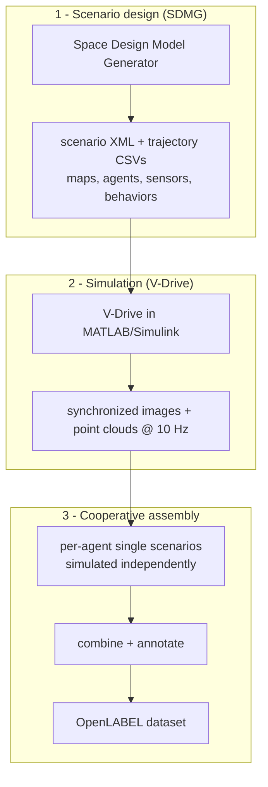

# Simulator — DIVP

RealSim-CP is generated with **DIVP (Driving Intelligence Validation
Platform)**, distributed as **V-Drive for MATLAB/Simulink®**. DIVP is a
physics-based sensor-simulation system that uses **ray tracing** and
**electromagnetic-wave modeling** to produce high-fidelity camera, LiDAR, and
radar data comparable to real-world quality.

!!! abstract "Official site"
    DIVP is developed under Japan's SIP (Strategic Innovation Promotion)
    program. Product information: <https://divp.net/>. This page summarizes how
    RealSim-CP uses it; it is not a substitute for the official V-Drive
    documentation.

## Why simulation

Real-world cooperative-perception data is expensive and slow to collect — it
requires many instrumented agents and large-scale multimodal labeling. DIVP
produces large volumes of **synchronized multimodal data** across diverse
scenarios and weather/time conditions at far lower cost, while staying close to
real sensor physics through calibration against real measurements.

### How it compares

Many simulators generate LiDAR by approximating object shapes and positions.
DIVP instead **physically simulates** camera and LiDAR operation from
electromagnetic-wave principles, renders spatially with ray tracing, and
improves accuracy through calibration with real-world experimental data.

## Sensor models

- **Camera** — models the spectral response incident on the CMOS sensor (rather
  than emitting RGB directly), with solar illumination from sky models, Monte
  Carlo ray-traced spatial rendering, and lens distortion. RealSim-CP uses a
  Sony **IMX490** model with a 120° horizontal field of view.
- **LiDAR** — ray traces signal propagation and solves the physical equations for
  received intensity, reproducing effects such as backlighting. RealSim-CP uses a
  Velodyne **VLS-128** model.

In Simulink, DIVP is organized as **blocks**, one per sensing/processing stage —
for example the camera chain (`CameraRendering`, `CameraPerception`, `ToRGB`,
`PostFog`, …), the LiDAR chain (`LidarRendering`, transmitter/receiver pairs,
`LidarV10`/`LidarV20`), radar, and scenario blocks (`Scenario`, `ScenarioReader`,
`ScenarioMerge`, `TrafficLight`).

## Generation pipeline

1. **Scenario design (SDMG).** The Space Design Model Generator produces the
   scenario definition (XML) and trajectory data (CSV): maps, agent
   configurations, sensor parameters, and behaviors.
2. **Simulation (V-Drive).** The scenario is imported into V-Drive, which builds
   the environment, runs the camera and LiDAR physics, and outputs synchronized
   image and point-cloud data at 10 Hz.
3. **Cooperative assembly.** DIVP does not natively support V2X scenarios, so a
   multi-agent scene is **decomposed** into several single-agent scenarios. Each
   sensor-equipped agent is simulated independently, then the outputs are
   recombined and annotated in OpenLABEL. A Python
   [automation tool](../tools/automation-tool.md) manages and sequentially runs
   the scenarios via the MATLAB engine.

## Performance

Generation used a virtual machine with an **NVIDIA RTX 6000 Ada** GPU. Rendering
a single `1158 × 750` image takes roughly **5–10 seconds** in clear weather and
**5–10 minutes** under rain. Camera and LiDAR data are recorded synchronously at
**10 frames per second**.

## Acknowledgement

The dataset was generated with the DIVP® simulator. We thank the DIVP consortium
for providing access to the platform. This work was supported by JST CRONOS,
Japan (Grant Number JPMJCS24K8).
