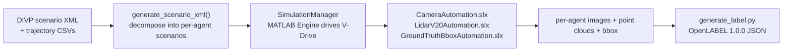

# DIVP Automation Tool

Automation around **DIVP** simulation runs: it parses DIVP scenario XML, drives
the MATLAB/Simulink models that render camera and LiDAR data for each agent, and
generates **OpenLABEL 1.0.0** annotations from the simulation outputs. This is
the tool used to produce the RealSim-CP dataset.

**Location:** [`tools/divp-automation-tool/`](https://github.com/tlab-wide/realsim-cp/tree/main/tools/divp-automation-tool)

!!! note "Requires DIVP / MATLAB"
    This tool drives the DIVP **V-Drive** Simulink models through the MATLAB
    Engine, so it needs a licensed MATLAB and access to DIVP. It is published
    here for transparency and reproducibility; most users only consume the
    resulting dataset and do not need to run it. See
    [Simulator (DIVP)](../simulator/divp.md).

## How it works



- **`main.py`** — entry point. `generate_scenario_xml()` decomposes a multi-agent
  scenario into per-agent scenario XMLs; `SimulationManager` starts the MATLAB
  engine, loads the Simulink models, and simulates each sensor-equipped agent.
- **`generate_label.py`** — assembles the OpenLABEL annotation file (streams,
  coordinate systems, per-frame transforms, object cuboids) from the outputs.
- **`lib/calculate_matrix.py`** — rotation-matrix / Euler→quaternion helpers.
- **`lib/utils.py`** — JSON I/O helpers.
- **`*.slx`, `*.m`, `*_automation.json`** — the MATLAB/Simulink automation models
  and their render configs (camera + LiDAR V20).

## Requirements

- Python **3.11+**
- `matlabengine==24.1.4`, `numpy>=2.3.4`, `pandas>=2.3.3` (see `pyproject.toml`)
- A licensed MATLAB compatible with the `matlabengine` version, plus the DIVP
  V-Drive toolbox.

## Install & run

```bash
cd tools/divp-automation-tool
pip install -e .
```

```bash
python main.py
```

By default `main.py` runs the `automation_scenario` example. The expected layout
is a `scenarios/<name>/` tree containing the DIVP scenario XML, OSI supplement
JSON, and trajectory CSVs; outputs are written under
`scenarios/<name>/output_data/`.

!!! info "Scenario data not bundled"
    The large per-location scenario inputs/outputs are **not** included in this
    repository. The rendered, annotated result is the published
    [RealSim-CP dataset](../dataset/download.md).
