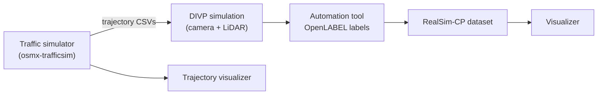

# Tools

This repository bundles the in-house tools for working with RealSim-CP. Each
lives under [`tools/`](https://github.com/tlab-wide/realsim-cp/tree/main/tools)
and has its own README.

| Tool | What it does | Language | Location |
|---|---|---|---|
| [Visualizer](visualizer.md) | 3D + per-agent dashboard viewer for the dataset | Python · Open3D | `tools/realsim-cp-visualizer/` |
| [Automation tool](automation-tool.md) | Generates OpenLABEL labels from DIVP simulation runs | Python · MATLAB | `tools/divp-automation-tool/` |
| [Trajectory visualizer](trajectory-visualizer.md) | Plots agent trajectories from CSVs | Python · Matplotlib | `tools/trajectory-visualizer/` |
| [Traffic simulator](traffic-simulator.md) | Generates naturalistic traffic for scenarios | Python | external repo |

## Where each tool fits in the pipeline

- **Traffic simulator** produces agent trajectories that feed scenario design.
- **DIVP** renders the synchronized camera + LiDAR data (see
  [Simulator](../simulator/divp.md)).
- **Automation tool** orchestrates the runs and writes OpenLABEL annotations.
- **Visualizer** and **Trajectory visualizer** inspect the results.
