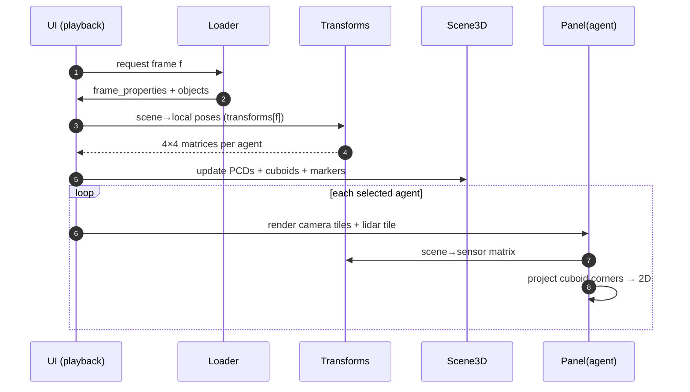

# RealSim-CP Visualizer

A desktop viewer (Python + **Open3D**) for RealSim-CP variants. It renders LiDAR
point clouds, camera streams, 3D bounding boxes, and agent (vehicle + RSU) poses
— either **fused in one 3D scene** or **broken out per-agent** in an inspectable
dashboard.

**Location:** [`tools/realsim-cp-visualizer/`](https://github.com/tlab-wide/realsim-cp/tree/main/tools/realsim-cp-visualizer)

## What it answers

- Does the fused multi-agent point cloud overlap correctly?
- Is one agent's calibration drifting versus another's?
- Which agent first sees a given object, and how many frames before another does?
- Do the 3D cuboids reproject onto the right pixels in each camera?

## Requirements

- **Python 3.12** — Open3D does not yet support 3.14 on Windows. You can keep
  3.14 for other work and install 3.12 alongside it.
- Dependencies (installed automatically): `numpy>=1.26`, `open3d>=0.18`,
  `Pillow>=10`.

## Install

=== "Windows (PowerShell)"

    ```powershell
    cd tools/realsim-cp-visualizer
    py -3.12 -m venv .venv
    .\.venv\Scripts\activate
    python -m pip install -e .
    ```

=== "macOS / Linux"

    ```bash
    cd tools/realsim-cp-visualizer
    python3.12 -m venv .venv
    source .venv/bin/activate
    python -m pip install -e .
    ```

??? tip "`py` not recognized?"
    Install Python 3.12 from
    <https://www.python.org/downloads/release/python-312/> and include the
    **Python Launcher** during installation, then re-open your terminal. Verify
    with `py -0p`.

## Run

Point the viewer at a downloaded variant folder:

```powershell
python -m realsim_viz "C:\data\RealSim-CP\daiba_station_scenario\night_1"
```

The viewer tolerates missing point-cloud files (required for the `sunny_1` /
`sunny_2` variants — see [Known issues](../dataset/known-issues.md)).

## Controls

| Control | Action |
|---|---|
| **Space** | Play / pause |
| **← / →** | Step one frame |
| **View buttons** | Switch the 3D scene between Top, Side, and 3D angled views |
| **Sidebar** | Toggle scene layers, individual agents, **All RSUs**, **All vehicles** |
| **Dashboard** | Choose an agent, then **Add camera** / **Add lidar** tiles |
| **Overlay LiDAR** | Project the selected agent's LiDAR onto a camera tile (toggle / pick source) |
| **Distortion** | Apply the label file's `k1…k6` distortion (default: pinhole) |
| **Loaded data** | Expand the sidebar section for frame / agent / sensor / object counts |
| **Maximize** | Open a selected tile in a larger dialog |

## Implemented layers

- Source-colored LiDAR point clouds (per agent)
- Scene-frame 3D cuboids (per class color)
- Agent markers (vehicles from their labeled cuboid; RSUs as poles)
- Camera frustums
- Agent trajectories
- Per-agent camera & LiDAR dashboard tiles
- LiDAR scan projection over camera tiles
- Loaded-dataset summary
- Maximized camera/LiDAR tile dialog

## How it works (data flow)



Source modules: `loader.py` (parse OpenLABEL), `transforms.py` (quaternion/matrix
math), `projection.py` (intrinsics + cuboid corners), `scene_3d.py` (Open3D
scene), `panels.py` (camera/LiDAR tiles), `playback.py` (frame clock),
`colors.py` (stable palettes), `app.py` (GUI).
